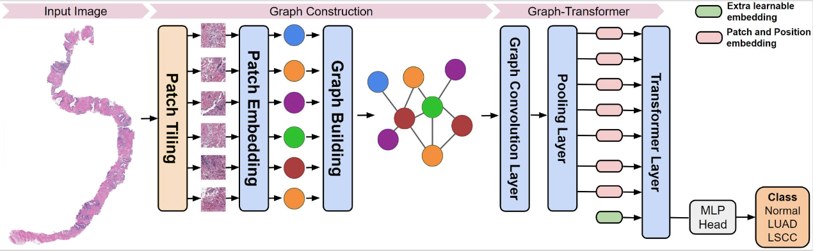
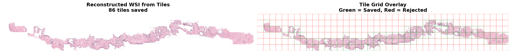

# GTP-PANDA

Graph Transformer for Prostate cANcer Detection and grAding (GTP-PANDA) - A deep learning framework for analyzing prostate histopathology images using graph-based representations and transformer architectures.

## Table of Contents

- [Overview](#overview)
- [Project Structure](#project-structure)
- [Installation](#installation)
- [Usage](#usage)
- [Configuration](#configuration)
- [Training](#training)
- [Evaluation](#evaluation)
- [Citation](#citation)

## Overview

GTP-PANDA implements a graph-based deep learning approach for prostate cancer detection and Gleason grading from whole slide images (WSI), based on [this paper](https://ieeexplore.ieee.org/document/9779215).

The framework build feature-based graphs from histopathology slides and processes them using a Graph-Transformer (GT) network, enabling WSI-level predictions.

### What's Included

- **Full training pipeline** — Feature extraction, graph construction, and model training
- **Jupyter notebooks** — Step-by-step guides for preprocessing, troubleshooting, and data analysis
- **Multiple backbones** — Support for Phikon, ImageNet ResNet50, and SimCLR feature extractors


## Current Project Structure

```
PANDAS/
├── feature_extractor/
├── models/
│   ├── GraphTransformer.py (model)
│   └── ...
├── data/
│   ├── train.csv
│   ├── splits/
│   │   ├── train_split.csv     # 80% of training data
│   │   └── val_split.csv       # 20% for validation
│   └── patches/
│       ├── train_patch_01.csv  # Training data split into
│       ├── train_patch_02.csv  # 10 equal patches for
│       ├── ...                 # sequential processing
│       └── train_patch_10.csv
├── scripts/
│   ├── split_train_valid.py    # Script to create 80/20 split
│   └── patch.py                # Script to create 10 patches
├── train_panda.py (main script to start model training)
├── utils/
│   └── metrics.py (metrics script)
├── README.md
└── environment.yml  # (optional)
```

### Prerequisites

- Python 3.8+
- CUDA-capable GPU (recommended)
- Conda or pip package manager

## 0. Data Preprocessing
Preprocessing pipeline consists of patching, feature extraction and graph construction.

<p align="center">
  
</p>

Imaged borrowed and slightly edited from [this repo](https://github.com/vkola-lab/tmi2022/blob/main/README.md)


## 1. PANDA Patch Extraction Process

Extracts tissue patches from WSIs using a sliding window approach, filtering out background and saving only informative tiles.

**Notebook:** `/patch_extraction/Patch_Extraction.ipynb`
### Reconstructed Tile Layout

<p align="center">
  
</p>


## tile_one_slide function:  
What each worker does: 
1. Open a WSI using openslide,
2. Calculate how many slides the tile will generate
3. For every (x,y): 
    - Create a 512x512 tile 
    - Filters Background
    - Saves tiles into a folder name of the WSI's ID.
4. Logs Progress after crate 200 tiles
5. Outputs how many tiles were saved

## 2. Feature Extraction

Extract features and build tissue graphs from whole slide images.

### Option A: Using Config File
```bash
cd feature_extractor
python run.py --config config_panda.yaml
```

Edit `config_panda.yaml` to customize:
- Input WSI directories
- Patch size and magnification
- Graph construction parameters (k-NN, radius, etc.)
- Feature extractor backbone

### Option B: Using Notebooks

| Backbone | Notebook Location |
|----------|-------------------|
| SimCLR | `feature_extractor/SimCLR Feature Extractor.ipynb` |
| ImageNet ResNet50 | `feature_extractor/ImageNet ResNet50 Feature Extraction/ResNet50 ImageNet.ipynb` |
| Phikon | `feature_extractor/Phikon Feature Extractor.ipynb` |

## 3. Graph Construction

Build graphs from WSI patches using ResNet50 features:
```bash
python build_graphs.py
```

**Output:** `./graphs_all/panda/<wsi_id>/`
- `features.pt`: Node features [num_patches, 2048]
- `adj_s.pt`: Adjacency matrix (8-connectivity)
- `c_idx.txt`: Patch coordinates

**Time:** ~2-3 hours for all subsets

---

## 4. Training

Training scripts are located in the project root directory.

### Graph Transformer (GTP)
```bash
# Train with different backbones by modifying n_features and data_path:

# SimCLR (512-dim)
qsub train_gtp.sh

# ImageNet ResNet50 (2048-dim) - edit train_gtp.sh:
#   --n_features 2048
#   --data_path './feature_extractor/graphs_imagenet/panda'

# Phikon (768-dim) - edit train_gtp.sh:
#   --n_features 768
#   --data_path './feature_extractor/graphs_phikon/panda'
```

### Graph Attention Network (GAT)
```bash
qsub train_gat.sh
```

### Training Configurations

| Script | Model | Backbone | Features | GPU Memory |
|--------|-------|----------|----------|------------|
| `train_gtp.sh` | Graph Transformer | SimCLR | 512 | 40GB |
| `train_gat.sh` | GAT | Phikon | 768 | 16GB |

### Outputs

- **Models:** `./graph_transformer/saved_models/`
- **Logs:** `./logs/`
- **Tensorboard:** `./graph_transformer/runs/`

### Monitor Training
```bash
# Check job status
qstat -u $USER

# View training logs
tail -f logs/gat_train_<JOB_ID>.log
or using cat to check on the logs.
```


## 5. Evaluation
Improvements
ResNet50 Backbone with Original GTP Baseline ran (main_baseline.py)
ResNet50 BackBone with GTP Class-Balancing and Cosine Annealing LR -> (main.py)


## Configuration

**Key Parameters:**
- `--n_features 2048`: Feature dimension (ResNet50)
- `--batch_size 8`: Batch size
- `--num_epochs 50`: Training epochs

**Data Format (`train_set.txt`):**
```
panda/<wsi_id>	<label>
```

Labels: 0 (Background), 1 (Benign), 2 (Cancerous)

## Dataset (Updated by Manuel Morteo (Manny))
This project uses the PANDA (Prostate cANcer graDe Assessment) challenge dataset. 

**Data Structure:**
- `data/training.csv`: Contains slide IDs, ISUP grades, and Gleason scores
- Expected columns: `image_id`, `data_provider`, `isup_grade`, `gleason_score`

The full PANDA dataset (~400 GB) contains over 10,000 high-resolution whole-slide images (WSIs) from two data providers — Radboud University Medical Center and Karolinska Institute — each labeled with an ISUP grade and Gleason score.

### PANDA Dataset
Download the PANDA dataset from [Kaggle](https://www.kaggle.com/c/prostate-cancer-grade-assessment).

Because of the dataset's large size, this project works with a **smaller, representative subset** that preserves balance across ISUP grades and data providers. 

### Data Preparation Pipeline

1. **Train/Validation Split**: We used `scripts/split_train_valid.py` to split the data into an 80%-20% ratio for our training data and validation data.

2. **Patch Creation**: We then used `scripts/patch.py` to split our training data into 10 patches for easier training sequencing. This approach allows us to:
   - Download and upload smaller portions of data from Kaggle to the SCC
   - Manage memory constraints more effectively during training
   - Process data in manageable chunks within storage quota (I think we get 1TB, not entirely sure.)

**Final Data Structure:**
```
PANDAS/
  data/
    train.csv
    splits/
      train_split.csv     # 80% of training data
      val_split.csv       # 20% for validation
    subsets/
      train_patch_01.csv  # Training data split into
      train_patch_02.csv  # 10 equal patches for
      ...                 # sequential processing
      train_patch_10.csv
```


## Created a PANDAS environment on the SCC,

SCC Enviornment:
 - Modules loaded:
    1) python3/3.10.12 
    2) cuda/12.5 
    3) pytorch/1.13.1

Evaluation metrics implemented in `utils/metrics.py`:
- Quadratic Weighted Kappa (primary metric)
- Accuracy
- Confusion Matrix
- Per-class precision/recall

## Model Architecture

The Graph Transformer model (`models/GraphTransformer.py`) implements:
- Multi-head graph attention layers
- Positional encodings for spatial information
- Global pooling for slide-level predictions
- Classification head for ISUP grade prediction (0-5)

## Contributing

Contributions are welcome! Please:
1. Fork the repository
2. Create a feature branch
3. Submit a pull request with a clear description

## License

This project is licensed under the MIT License - see LICENSE file for details.

## Contact

For questions or issues, please open an issue on GitHub or contact [mmorteo@bu.edu].

## Acknowledgments

- PANDA Challenge organizers
- Graph neural network and transformer architecture references
- Open-source libraries used in this project

---

**Note:** Update paths, URLs, and contact information according to your specific implementation.
